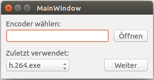
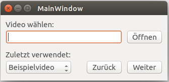
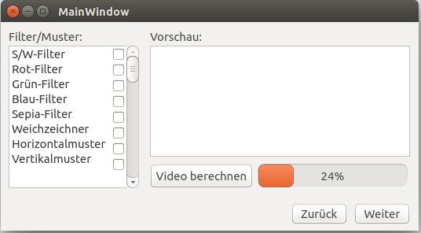
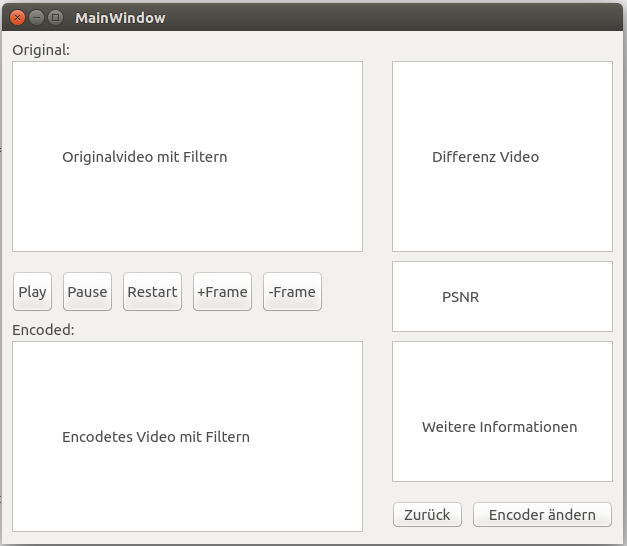

#7. Benutzungsoberfläche

## 7.1 Anforderungen

/B10/ Die Bedienungsoberfläche ist auf Mausbedienung ausgelegt, eine Bedienung ohne Maus muss dennoch möglich sein

/B20/ DIN 66234, Teil 8 ist zu beachten

/B30/ Die Benutzungsoberfläche besteht aus mehreren aufeinander folgenden Fenstern

/B40/ Die Größe der Fenster ist vordefiniert und kann nicht verändert werden

/B50/ Die Benutzungsoberfläche führt den Benutzer Schritt für Schritt durch das Programm

/B60/ Die Benutzungsoberfläche bietet jederzeit die Möglichkeit zu einem früheren Schritt zu springen

/B70/ Die Benutzungsoberfläche wird aus Elementen des Qt Designer aufgebaut 

## 7.2 Dialogstruktur

## 7.3 Beispieldesign

### 7.3.1 Encoderauswahl:

### 7.3.2 Videoauswahl:

### 7.3.3 Filter/Muster:

### 7.3.4 Wiedergabe und Auswertung:

